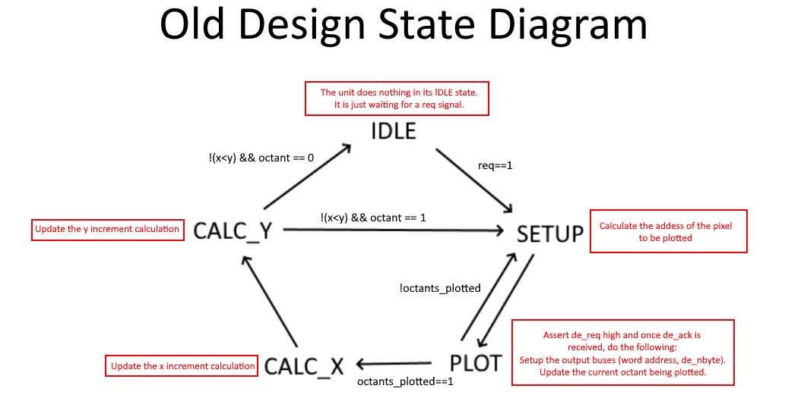
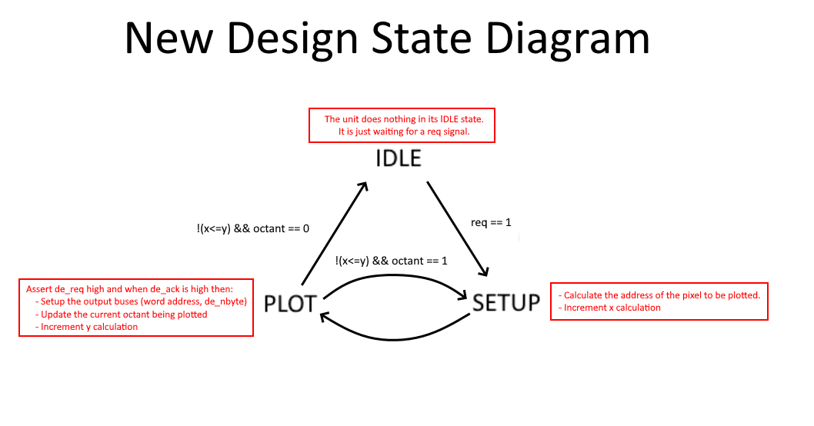
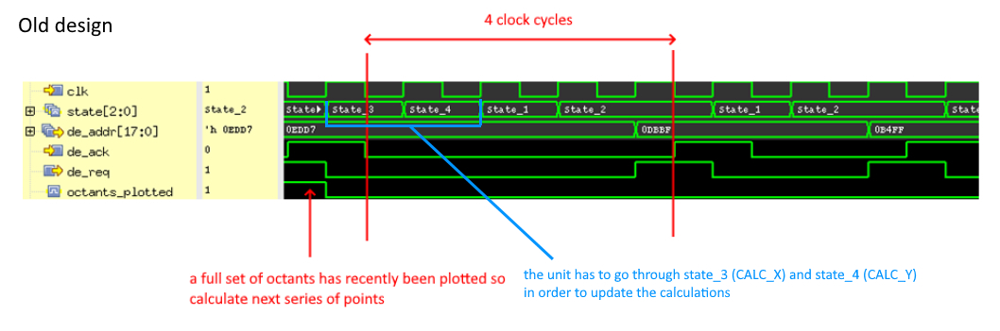

# Bresenham Circle Drawing Unit
## Table of Contents

  * [🗺️ Overview](#%EF%B8%8F-overview)
  * [⚙️ Specification and how it works](#%EF%B8%8F-specification-and-how-it-works)
  * [✍️ Design and Test Verification](#%EF%B8%8F-design-and-test-verification)
  * [📈 Results](#-results)
  * [❗ Improvements to be made](#%EF%B8%8F-improvements-to-be-made)
  * [✔️ New and improved circle drawing unit](#%EF%B8%8F-new-and-improved-circle-drawing-unit)
  

## 🗺️ Overview

This is a Verilog implementation of a synchronous drawing unit that is capable of drawing circles to a 640x480 framestore using Bresenham's Circle Algorithm. The design is synthesisable to a Xlinx Spartan-3 FPGA.

## ⚙️ Specification and how it works

Below is a schematic of the drawing unit alongside its register-level documentation for all the parts of the drawing unit that are used.


Bresenham's circle algorithm exploits the symmetric nature of a circle - we can divide the circle into 8 octants (thus each octant is 45 degrees) so that we only need to figure out how to draw a single octant, then perform reflections and swapping of x,y coordinates in the calculations of the single octant to be able to plot the rest of the octants. A decision parameter 'e' denotes whether (x+1, y-1) or (x+1, y) of the next pixel to be plotted is closer to the arc of the circle. The pseudocode is shown below.

```
x = 0; // incrememental value for x
y = r; // incremental value for y
plot ([x,y],[y,x],[x,-y],[-y,x],...); // Plot the 8 octants by reflections and swapping of x,y
e = y; // e denotes our decision parameter
while (x < y) // continue up to the 45° point
  x = x + 1;
  e = e - 2*x;
if (e < 0) //if e < 0 then (x+1, y-1) is closer to the arc of the circle
  y = y - 1;
  e = e + 2*y;
  plot ([x,y],[y,x],[x,-y],[-y,x],...);
```

## ✍️ Design and Test Verification

The test strategy is derived from the use of a stimulus file to simulate the drawing unit and view its waveforms. Simply viewing the waveforms is not enough to verify this unit as this is messy and unintuitive to read. I've developed a high-level model coded in Python in order to automate the testing procedure by comparing the outputs of the waveforms to the outputs of the high-level model - this forms the basis for my design verification.


The tests also need to be verified, strong test coverage is ensured by maintaining a relatively high block, expression and bit coverage. The coverage tool used is Cadence's Incisive Comprehensive Coverage.


## 📈 Results

The figure below demonstrates the drawing unit in action on a Virtual Screen.


## ❗ Improvements to be made

Despite the success of the unit, there are many crucial adjustments or improvements that can be made.

  * The design is highly serial. There are many calculations or operations that could've been done in the same state or in a previous state. For example, in the same state that the output buses are asserted, the calculations can be updated in the meantime instead of having separate states to do the calculations. This would reduce the number of states and thus will take less cycles to plot the circle.
  * Some multiplications can be replaced with shift operations to exploit the efficiency of shifter blocks. For example, e <= e + 2*y; should be e <= e + (y<<1);
  * The response to the req signal is not supposed to be spurious - the unit will respond to a request even whilst its busy
  * reset_variables is not needed and has also resulted in conflicting simultaneous values - only one operation should be allowed at a time with non-blocking assignments
  * octants_plotted reg is not needed as this is just equal to 'octant==0'
  * It takes 4 clock cycles to plot a pixel for a new set of octants due to the inefficient, serial design

## ✔️ New and improved circle drawing unit

I have decided to rework my approach to the implementation of the circle drawing unit as the design explored above does not exploit the nature of concurrency that Verilog offers.

### Converting a serial design into a concurrent design

As mentioned previously, many calculations could've been done in the same state or previous state. In the new design, the calculations to update the y increment (previously done in a separate state 'CALC_Y') are done at the same time as the output buses being asserted in the 'PLOT' state (i.e. whilst the unit is plotting a pixel, update the calculations for the next set of octants where necessary). Updating the x increment (previously done in a separate state 'CALC_X') can be done prior to the updating of the y increment by placing the x <= x+1; statement in the 'SETUP' state. A slightly different [algorithm](https://www.geeksforgeeks.org/bresenhams-circle-drawing-algorithm/) is used to complement these changes. A comparison between the state diagrams for the old vs new design is given in the images below.




The drawing unit does indeed work as intended, however due to the concurrent nature of the design, the pixels plotted are slightly different to what is expected of a serial model as e and y are updated at the same time. This is not a problem as a circle is still drawn nonetheless.


The improved design has also fixed the problem where the old design would take 4 clock cycles to plot a pixel for each new set of octants (as it needs to go through the CALC_X and CALC_Y states just to update the calculations). Now it consistently takes 2 clock cycles to plot a pixel as it doesn't need to go through 2 extra states to update the calculations - it has been done simultaneously in the 'SETUP' and 'PLOT' states.




As a result of these changes, the maximum clock frequency has increased from 62.139MHz to 62.559MHz. The state diagram and logic of the unit has been simplified massively also.


### Smaller changes
  * Some multiplications have been replaced with shift operations where possible
  * Response to req signal is no longer spurious
  * reset_variables task has been removed
  * octants_plotted reg has been removed
  

